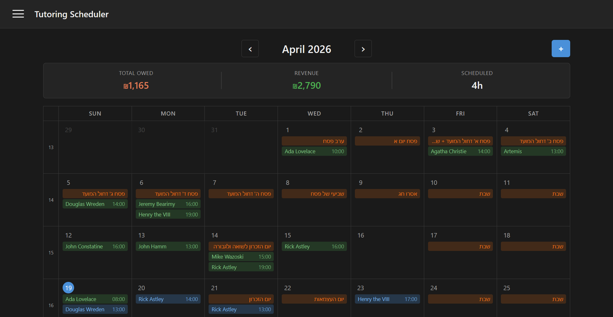
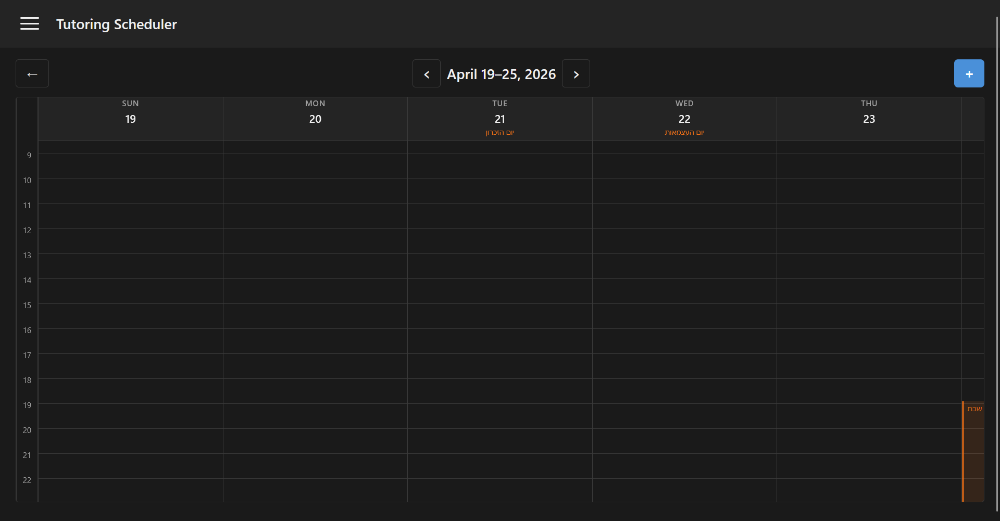
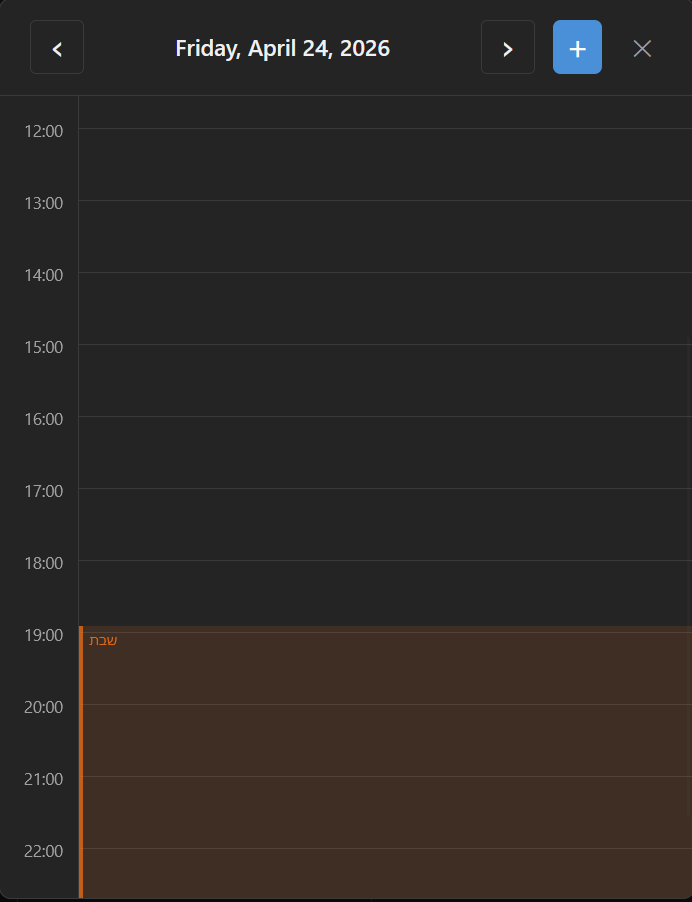
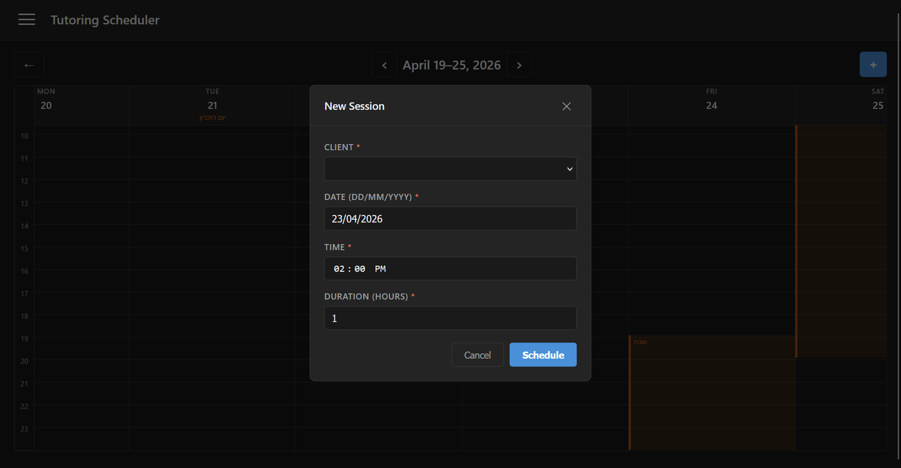
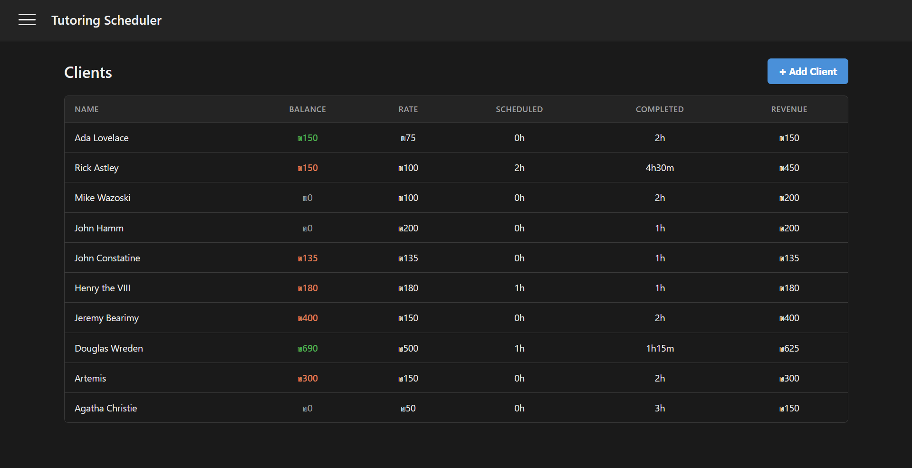
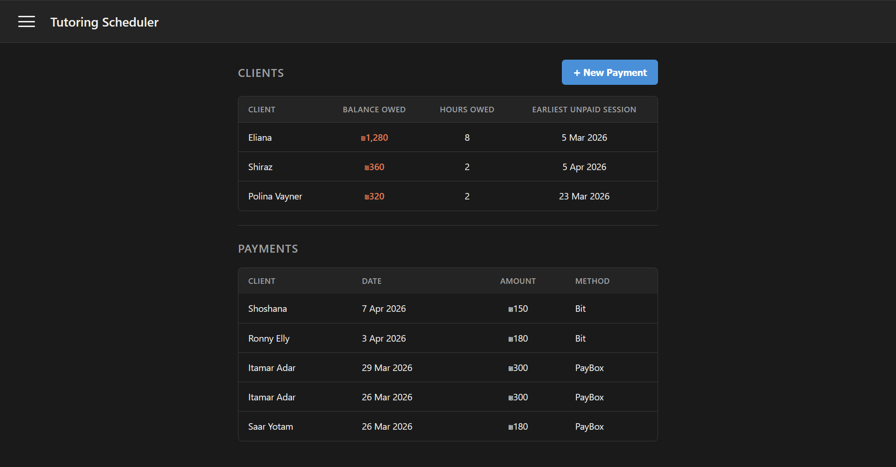
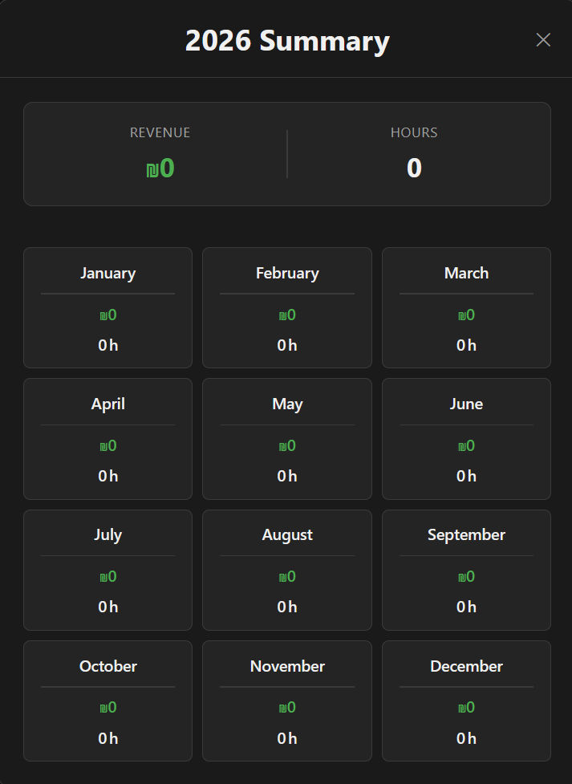

# Tutoring Scheduler

A personal full-stack web app for managing a tutoring business — built to replace a Google Sheets workflow with something purpose-built. Track sessions, clients, and payments from any browser, with a calendar that understands the Israeli Jewish calendar.

For a deep dive into the stack, data model, API routes, and design decisions, see [ARCHITECTURE.md](ARCHITECTURE.md).

---

## Screenshots

### Monthly Calendar View

*Month view with Israeli holidays highlighted in amber. Sessions appear as labeled blocks sorted by time within each day cell. The summary bar at the top shows total owed, revenue, and scheduled hours for the month.*

### Weekly View

*Week view with hour-block layout. Shabbat is shaded from Friday candle-lighting time. Israeli national holidays (Yom HaZikaron, Yom HaAtzmaut) appear with Hebrew labels in the column header.*

### Day View

*Day view as an overlay over the current view. Shabbat shading begins at candle-lighting time. Clicking a blank time slot opens the Add Session form pre-filled with that time.*

### Add Session Form

*Session form with client dropdown, DD/MM/YYYY date input, 12-hour time picker, H:MM segment duration input, and rate field. Date pre-fills based on context — the clicked day, the current week, or today.*

### Clients Page

*All clients in one table: balance owed (red when positive), per-session rate, scheduled hours, completed hours, and total revenue. All figures are derived at query time from sessions and payments — nothing is stored statically.*

### Payments Page

*Two-panel layout: clients with outstanding balances at the top (sorted by amount owed), full payment history below. Supports PayBox, Bit, Bank Transfer, Cash, and Other.*

### Yearly Summary

*Year-at-a-glance modal showing total revenue and hours for the year, broken down by month.*

---

## Features

### Calendar

- **Three views** — Month, Week, and Day. Navigating into a sub-view and back returns you to the same position in the parent view.
- **Israeli Jewish holidays** — Shabbat with accurate candle-lighting time shading (dynamically calculated per week in week/day views), national holidays, and chagim shown in Hebrew.
- **Session blocks** — color-coded by status (blue for Scheduled, green for Completed), sorted by time within each day cell in month view.
- **Monthly summary bar** — total owed, revenue for the month, and scheduled hours always visible at the top of month view.
- **Yearly summary modal** — revenue and hours broken down by month for the full year.
- **Week number column** — ISO week numbers shown on the left edge of the month grid.

### Sessions

- **Add, edit, and delete** sessions with client, date, time, duration, rate, and status fields.
- **Per-session rate** — each session stores the hourly rate at the time it was booked, so billing remains accurate even if a client's rate changes later.
- **H:MM duration input** — a custom segment input for hours and minutes; auto-advances between segments, supports arrow-key increment/decrement, enforces a 30-minute minimum.
- **Status lifecycle** — Scheduled → Completed → Cancelled. Sessions automatically flip from Scheduled to Completed once their end time has passed; this is triggered lazily on page load or any data fetch rather than by a background timer.
- **Overlap detection** — blocks submission if the new session conflicts with an existing one for the same time slot.
- **Smart form defaults** — date pre-fills from context (day view click, current week, or today); time pre-fills from the clicked hour slot in day view.
- **Validation warnings** — past dates and unusual hours (before 7am or after 11pm) surface a warning but allow override after acknowledgement.

### Clients

- Store name, per-session rate, phone number, and parent phone number.
- All financial stats (balance owed, total revenue, hours completed, hours scheduled) are derived at query time from the Sessions and Payments tables — never stored directly.
- Per-client profile with upcoming sessions and payment history accessible from the clients list.

### Payments

- Log payments by method: **PayBox, Bit, Bank Transfer, Cash, Other**.
- Optional receipt/invoice number field.
- **Balance click shortcut** — clicking a client in the "clients owed" panel pre-fills the payment form with their outstanding balance.
- Payments can exceed the current balance, supporting clients who pay ahead for future sessions.
- Balance is always live: `SUM(completed session duration × rate / 60) − SUM(payments)`.

### Auth

- Single-password login secured by JWT. The token is stored client-side and sent with every API request.

---

## Tech Stack

| Layer | Technology |
|---|---|
| Frontend | React 18, Create React App |
| Styling | Custom CSS, dark mode by default |
| Date handling | Custom utilities + `react-datepicker` |
| Holiday data | Static Hebrew calendar dataset (no external API) |
| Backend | Node.js + Express |
| Database | SQLite via Node's built-in `node:sqlite` (no ORM) |
| Auth | JWT (JSON Web Tokens) |
| Dev tooling | `concurrently` for running client + server in parallel |

---

## Project Structure

```
├── client/
│   └── src/
│       ├── components/      # Unified modals (SessionModal, PaymentModal, ClientModal,
│       │                    #   ConfirmDeleteModal) and shared UI (Sidebar, LoginScreen,
│       │                    #   YearlySummaryModal)
│       ├── views/           # CalendarView, WeekView, DayView, ClientsView, PaymentsView
│       ├── styles/          # CSS files scoped per view and component
│       └── utils/           # API wrapper, date helpers, static holiday data
└── server/
    ├── routes/              # Express routers: auth, clients, sessions, payments
    ├── middleware/           # JWT auth guard applied to all protected routes
    └── db/                  # SQLite setup and schema
```

The frontend and backend are separate packages under a monorepo root. `npm run dev` uses `concurrently` to start both simultaneously.

---

## Data Model

### Clients
| Field | Notes |
|---|---|
| ID | Integer primary key (auto-assigned) |
| Name | Unique — still required to be unique |
| Rate | Default per-session rate in ₪/hour |
| Phone | Student contact |
| Parent Phone | Optional |

### Sessions
| Field | Notes |
|---|---|
| ID | Integer primary key (auto-assigned) |
| Client | Foreign key → `clients.id` |
| Date + Time | Session date (YYYY-MM-DD) and time (HH:MM) |
| Duration | In minutes |
| Rate | Hourly rate captured at booking time (₪/hour); `cost = duration × rate / 60` |
| Status | `Scheduled` / `Completed` / `Cancelled` |

### Payments
| Field | Notes |
|---|---|
| ID | Integer primary key (auto-assigned) |
| Client | Foreign key → `clients.id` |
| Date | Payment date (YYYY-MM-DD) |
| Amount | In ₪ |
| Method | PayBox / Bit / Transfer / Cash / Other |
| Receipt # | Optional reference number |

All balance and revenue figures are computed from these three tables at query time.

---

## Getting Started

### Prerequisites

- Node.js 22+ (required for `node:sqlite`)

### Install

```bash
npm install
cd client && npm install
cd ../server && npm install
```

### Configure

Create `server/.env`:

```env
APP_PASSWORD=your_password
JWT_SECRET=your_secret
PORT=3001
DB_PATH=./db/scheduler.db   # optional, defaults to server/scheduler.db
```

### Run in development

```bash
npm run dev
```

Starts the Express backend on port 3001 and the React dev server on port 3000 concurrently.

### Build for production

```bash
npm run build   # builds the React frontend
npm start       # serves everything from Express on port 3001
```

---

## Notes

**Holiday data** is stored as a static dataset rather than fetched from an external API, keeping the app fully self-contained with no runtime dependency on third-party calendar services.

**Shabbat shading** in week and day views is calculated dynamically per date using the standard 18-minutes-before-sunset approach adjusted for Israel's latitude.

**No ORM** — all queries are written directly in SQL via `node:sqlite`, the SQLite module built into Node 22.

---

Icon from [Twitter Twemoji](https://github.com/twitter/twemoji) (CC-BY 4.0).
